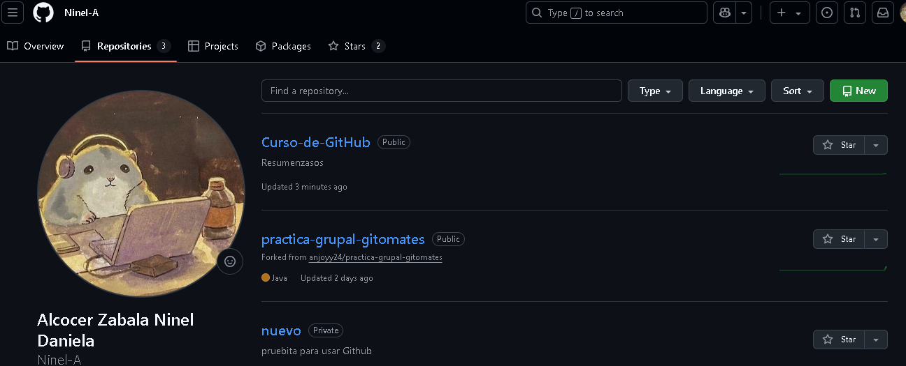
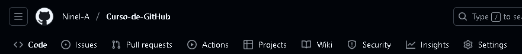
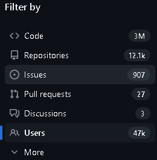

# Curso-de-GitHub

## 🐈‍⬛ INTRODUCCIÓN 🐈‍⬛(Conceptos básicos)

### **Git y GitHub. ¿Son lo mismo?**

Cuando recién comenzamos a usar estas herramientas, es normal confundirse, pero *no*, no son lo mismo, sin embargo están fuertemente relacionados. 

|                | Git                  | GitHub               |
|----------------|----------------------|----------------------|
| Tipo           | Sistema de control de versiones | Plataforma de alojamiento en la nube, basado en Git |
| Instalación    | Trabajar de forma local (en nuestra PC) (SOFTWARE)   | Online, crear una cuenta y registrarse (SERVICIO) |
| Colaboración   | Repositorios locales | Repositorios remotos, ideal para trabajar en grupo |

### Control de versiones

Nos pasó un montón de veces: hacemos un proyecto, pero seguimos realizando más y más cambios, sin darnos cuenta terminamos con archivos como *trabajo1*, *trabajo1ver1*, *trabajo1FINAL*. Un control de versiones soluciona este problema, registra cada cambio que se realza en nuestro código, quién lo hizo y cuando. 

Entre sus ventajas están que es flexible, seguro, trabajas en equipo, sin riesgos y con mejor organización. 
---
# GIT
 

Una vez descargado este software (segun tu sistema operativo), podemos administrar una copia alojada de nuestro repositorio localmente en nuestra máquina. 

## 🎁Repositorio : 
Es una carpeta en la que almacenaremos todo lo que nuestro proyecto necesita, versiones de ficheros, imagenes, documentos; recuerda cada cambio que haces. Es un pilar fundamental tanto de Git como de GitHub.


 Git utiliza la terminal, desde ella puedes ejecutar comandos para interactuar con el sistema, pero antes debemos registrarnos: Configurar nuestro usuario y gmail que será con los que crearemos nuestra cuenta en GitHub. 

 ```bash
$ git config --global user.name "tu user, sé creativo"
$ git config --global user.email "tu correo personal" 

```
Si necesitas otra configuración para algun repositorio (asegurate de estar en su directorio) solo omite el *--global*

```bash
$ git config user.name "tu user"
$ git config  user.email "tu correo" 

```
### Algunos comandos de configuración extra 
```bash
$ git config --global core.editor "editor de texto de tu elección"  //cambiar vim que viene por default

$ git config --list  //muestra toda tu configuración
$ git config --global --list //muestra la configuración global
$ git config --local --list  //muestra configuración del repositorio local 
$ git config --system --list //muestra configuracion del git del sistema
```
---
## Iniciando un nuevo repo 🏁🏎️
Para crear un repositorio local tenemos algunos comandos 
```bash
$ git init nuevo-proyecto //usar guiones en lugar de espacios al indicar el nombre
$ cd nuevo-proyecto //change directory a nuestro proyecto

// o si ya tienes una carpeta existente
$ cd <directorio de tu carpeta del proyecto>
$ git init

```
Luego se creará una **rama** principal llamada *main* o *master* (definición más adelante)
---
# States & Commits 
## Los tres estados de Git
| Estado       | Descripción                                                                 | Comando clave          |
|--------------|-----------------------------------------------------------------------------|------------------------|
| **Modified** 🖊️  | Archivo modificado/creado/eliminado, pero *no preparado* para guardar.       | (Editas el archivo)    |
| **Staged**   📦  | Cambios marcados para el próximo *commit*, preparado para ser aceptado en el repositorio local                | `git add archivo.txt`  |
| **Committed** 💾 | Cambios guardados *permanentemente* en el historial del repositorio local.   | `git commit -m "mensaje"`  |

Explicandolo con ejemplos podemos decir que:
- **Modified** : como cuando haces cambios en cualquier documento
- **Staged**: como cuando seleccionas páginas antes de imprimir
- **Commited**: cuando ahora sí guardas los cambios en tu documento

  Para restaurar cambios se usan
  
```bash
  
$ git restore index.html //restora un archivo
$ git restore //restaura todo el directorio
$ git restore '*.js' //restaura todos los archivos terminados en .js

$ git reset index.html //deshacer del estado STAGED al MODIFIED
```

## ⭐COMMITS ⭐
Esta es l aparte importante, los commits son los que registran los cambios producidos en el repositorio. Como fotografías firmadas por el autor, con fecha, localización y más. También puede ser entendido como un *checkpoint* en los videojuegos ya que:
- Guarda el estado actual de tu proyecto (código, archivos, estructura).
- Te permite volver atrás si algo sale mal.
- Marca progreso en el desarrollo.


Cuando hagamos un commit, se guardarán todos los cambios que tenemos en staging. Para gacerlo tenemos el siguiente comando.

```bash
  
$ git commit //crea un commit en el repositorio y añade una referencia en la rama actual, se debe añadir un mensaje o añadirlo con
$ git commit -m "Add a feature" //este es el título 
$ $ git commit -m "Add a feature" -m "características o información extra

//todo se guarda en el repositorio local


```
### 📍 HEAD 📍 
Es un puntero que hace referencia a el lugar del historial de cambios en el que te encuentras ahora, solo puedes estar en un solo lugar.

---
## 🌿 RAMAS  🌿
Una rama es una de las versiones de la colección de archivos y directorios del repositorio. Una instntánea de la división del estado del código. Permiten realizar un desarrollo *no lineal*. 

Es decir que cuando trabajas en grupo con un mismo código, cada uno trabajará dentro de una versión (evolución del código) en paralelo. 

Piensa en ellas como lineas de otros universos paralelos en el que se realizarán diferentes cambios, desde los más pequeños; estas se crea a partir de los commits y más adelante podrás fusionarlas para que tenga los cambios bien implementados. 


### Comandos

```bash
  
$ git branch mi-primera-rama //creamos una rama mientras estamos en la rama main
//pero ahora queremos estar en nuestra nueva rama
$ git switch mi-primera-rama

//o puedes usar este comando y crear y cambiarte a la nueva rama al mismo tiempo
$ git switch -c mi-primera-rama //se nombra sin espacios como los repositorios

//no se podrán crear dos ramas con el mismo nombre

```
Para poder crear la rama necesitas crear al menos **un commit**.
Listar ramas:
- git branch
- git branch --show-current
- git branch --sort=-committerdate
---
###Fusionar ramas:
Nuestras ramas tendrán dos destinos: o son olvidadas o son fusionadas a nuestra rama principal.

```bash
  
$ git merge my-branch //la rama my-branch pasará a ser canon y crea un nuevo commit

$ git merge --edit //abre el editor primero

$ git merge --no-commit //no hará el commit automáticamente

```
### Eliminar Ramas 🌲🪚

Después de fusionarlas es normal querer eliminarlas, si se elimina una rama que no se fusionó nos saldrá un mensaje de errror.

```bash
  
$ git branch --delete mi-primera-rama

//para eliminar la rama sin importar que esté o no mergeada 
$ git branch -D mi-primera-rama

```
Ten cuidado de no eliminar las ramas que necesites, perderás horas de trabajo.

---
Eliminar ramas en repositorios locales: Hora de podar

$ git remote prune origin --dry-run

$ git remote prune origin

#### Merge Fast-Forward 
Ocurre cuando la rama de destino (ej. main) no tiene nuevos commits después de que creaste tu rama (ej. feature). Git simplemente mueve el puntero de main al último commit de feature, sin crear un commit de merge adicional. 
#### Merge No Fast-forward
Forza la creación de un nuevo commit de merge incluso si es posible un fast-forward. Esto sirve para mantener un historial explícito de que hubo una fusión, útil para rastreabilidad. Se usa con el flag --no-ff:

```bash
  
git checkout main
git merge feature  # Si es posible, hará fast-forward

//No fast forward
git merge --no-ff feature  # Siempre crea un commit de merge

```
### Conflictos ⚠️


Ocurre cuando dos ramas modifican las mismas líneas en un archivo y Git no puede fusionarlas automáticamente.
git marcará las diferencias:
```bash
  <<<<<<< HEAD  
Código de la rama actual (ej. `main`)  
=======  
Código de la rama que intentas fusionar (ej. `changes`)  
>>>>>>> changes

```

#### ¿Cómo resolverlo? 

 Abre el archivo conflictivo y elige entre:
- Conservar los cambios de HEAD (tu rama actual).
- Conservar los cambios de la otra rama (changes).
- Combinar manualmente las partes útiles de ambos.

Elimina las marcas (<<<<<<<, =======, >>>>>>>) y guarda el archivo con el código final

---
# GITHUB 🐱
 

Es un servicio de alojamiento en la nube de código fuente, basado en el sistema de control de versiones de git para manejar repositorios. Añade funcionalidades útiles como una UI amigable, GitHub Actions, Webhooks o Dependabot. También existen otros servicios de alojamiento como Bitbucket o Gitlab, pero a diferencia de ellos GitHub tiene una gran comunidad opensource, interfaz sencilla, con herramientas únicas. Ideal para aprender. 

## Repositorios Remotos
Estos repositorios están hospedados en un servidor y que servirá de punto de sincronización entre diferentes repositorios locales.

Navegando por GitHub podemos encontrar nuestro perfil, en el que podemos ver todos nuestros repositorios, proyectos, etc.


---

En cada repositorio podemos ver los siguientes apartados. 


---

Y también podemos buscar perfiles, repositorios de otros y más.


---


### Clonar un repositorio remoto creado previamente:
Esto significa descargar una copia exacta del proyecto desde el servidor remoto, a nuestra computadora local. Para hacerlo necesitamos su dirección HTTPS o SSH que lo encontramos al presionar el botón **Code** en nuestro repositorio


```bash
  //con SSH
 $ git clone git@github.com:user/libro-javascript.git

// con HTTPS
$ git clone https://github.com/user-libro-javascript.git
```
### Enlazar un repositorio local con uno remoto:
Para vincular tu repo local con uno remoto:
```bash
git remote add <alias> <url-del-repositorio>
//con https
git remote add origin https://github.com/usuario/repo.git

//con SSH
git remote add origin git@github.com:usuario/repo.git
```

### Escribiendo en nuestro repositorio remoto:
Para enviar cambios de un repositorio local a uno remoto debemos ejecutar un comando y pasarle dos parámetros: el alias del repositorio remoto y el nombre de la rama sobre la cual queremos enviar cambios. 
```bash
#el alias es origin y la rama main
$ git push origin main
```
Si no te deja hacer *push* puede ser porque el repositorio local no tiene cambios que ocurrieron en el repositorio remoto. No es ideal hacerlo pero el comando -f  fuerza el push y salta el error.

### Crear ramas remotas:

```bash
git switch -c nombre-rama  # Crea y cambia a la nueva rama
# Equivalente a:
# git branch nombre-rama && git switch nombre-rama
git push origin nombre-rama  # Sube la rama al remoto (origin)
git branch -a  # Muestra todas las ramas (locales y remotas)
# Después de hacer commits locales:
git push origin nombre-rama  # Sube los nuevos commits

//errores comunes
# Error al intentar subir rama inexistente
git push origin rama-que-no-existe
# Mensaje: error: src refspec rama-que-no-existe does not match any
```
# PULL REQUEST (PR)
Una Pull Request (abreviado PR) es una solicitud para fusionar los cambios que hiciste en una rama (por ejemplo, en un fork) hacia otra rama de un repositorio. Es una de las funciones más importantes en trabajo colaborativo con Git y GitHub, pero también puedes usarla para que alguien revise tu código antes de unirlo, incluso si estás trabajando en solitario.
### ¿Cuándo se usa?
- Cuando trabajas en colaboración con otras personas.
- Cuando haces cambios en un proyecto y deseas que el dueño del repositorio los revise y acepte.
- Para mantener un flujo ordenado de revisión, discusión y fusión de código.

### ¿Cómo hacer una PR?
1. Haz cambios en una rama diferente a main (ej. feature/login).
2. Sube (push) tu rama al repositorio remoto:

```bash
$ git push origin nombre-de-tu-rama

```
3. GitHub te sugerirá automáticamente crear una Pull Request.
Al dar clic en Compare & pull request, se abrirá un formulario donde debes:
- Verificar que estás solicitando cambios al repositorio correcto (¡no a tu propio fork!).
- Comparar ramas: la tuya (feature) con la de destino (ej. main del repo original).
- Escribir un título claro y una descripción que explique qué hiciste y por qué.
- Confirmar y crear la Pull Request.

### Marcar una Pull Request como Borrador
Cuando aún no has terminado tus cambios pero quieres mostrarlos o empezar a recibir comentarios, puedes marcar tu PR como borrador.
Esto indica que todavía no está lista para fusionar, pero ya puede ser vista y revisada por otros. Puedes hacerlo al momento de crearla, usando el botón "Create draft pull request".

### Hacer una buena PR
- Lee el archivo CONTRIBUTING.md si el repositorio lo tiene.
- Respeta el estilo del repositorio (nombres de variables, uso de comillas, formato)
- Haz cambios específicos: una PR debería enfocarse en una sola funcionalidad.
- Explica bien qué hiciste: usa lenguaje claro y directo.
- Si puedes, adjunta capturas, gifs o videos mostrando tu funcionalidad.

### Revisar una PR
- Sé empático y respetuoso. Valora el tiempo de quien escribió el código.
- Sé claro y específico en tus comentarios. No digas solo "esto está mal", explica por qué.
- Usa las sugerencias de código en GitHub para proponer cambios concretos.
- Entiende el contexto del cambio: a veces un código "no perfecto" resuelve el problema.
- Puedes ayudar creando un archivo CONTRIBUTING.md con reglas y estándares del repo.

```bash
# Crear y cambiar a una nueva rama (antes de empezar cambios)
$ git switch -c nombre-de-tu-rama

# Hacer commit de tus cambios
$ git add .
$ git commit -m "Agrega formulario de contacto"

# Subir tu rama al repositorio remoto
$ git push origin nombre-de-tu-rama


```
# Flujos de trabajo

En proyectos reales, especialmente cuando hay muchas personas involucradas, necesitamos una estrategia para organizarnos. Existen varios **flujos de trabajo** según el equipo, la experiencia y la frecuencia de despliegue. Como **Git Flow**, **GitHub Flow**, **Trunk Based Development** y **Ship / Show / Ask**.

---

# GIT FLOW

Es uno de los flujos más clásicos. Divide el proyecto en **ramas principales** y **ramas de apoyo**, lo que permite trabajar en distintas etapas del proyecto al mismo tiempo.

### 🌳 Ramas principales
| Rama | Propósito |
|------|-----------|
| `main` o `master` | Código en producción (estable) |
| `develop` | Código en pre-producción, donde se integran nuevas funcionalidades |

---

### Ramas de apoyo

| Rama | ¿Desde dónde se crea? | ¿Dónde se fusiona? | Convención |
|------|------------------------|--------------------|------------|
| `feature-*` | `develop` | `develop` | Nuevas características |
| `release-*` | `develop` | `main` y `develop` | Preparar lanzamientos |
| `hotfix-*` | `main` | `main` y `develop` (o release) | Solución urgente a errores |

---

### Crear ramas feature

```bash
$ git switch develop
$ git checkout -b feature-nueva-funcionalidad


```

Al terminar, fusionamos en develop:
```bash
$ git checkout develop
$ git merge --no-ff feature-nueva-funcionalidad
$ git branch -d feature-nueva-funcionalidad


```
El flag `--no-ff` asegura que se cree un commit de merge, útil para rastrear los cambios de esa rama.

---

### Ramas release

Se usan para pulir detalles antes del lanzamiento. Pueden recibir pequeñas correcciones o cambios menores.
```bash

$ git checkout -b release-1.0 develop
//Luego se fusionan:
$ git checkout main
$ git merge --no-ff release-1.0
$ git checkout develop
$ git merge --no-ff release-1.0
$ git branch -d release-1.0

```
---

### Ramas hotfix

Son urgencias. Se crean desde `main` para solucionar errores ya desplegados.
```bash
$ git checkout -b hotfix-1.0.1 main
# corregimos el error...
$ git add .
$ git commit -m "Hotfix: corrige bug crítico"
$ git checkout main
$ git merge --no-ff hotfix-1.0.1
$ git checkout develop
$ git merge --no-ff hotfix-1.0.1
$ git branch -d hotfix-1.0.1

```


---

## 🐙 GITHUB FLOW

Una alternativa más simple que GitFlow, ideal para despliegues frecuentes. Se basa en:

1. Crear una rama desde `main`
2. Subir cambios y abrir una Pull Request
3. Discutir y revisar los cambios
4. Fusionar en `main`

```bash
$ git checkout -b feature-login main
$ git add .
$ git commit -m "Agrega login"
$ git push origin feature-login
```

Está orientado a colaboración, uso intensivo de PRs y CI (integración continua).

---

## TRUNK BASED DEVELOPMENT

Aquí **todo el trabajo ocurre en la rama principal** (`main` o `trunk`). Las ramas auxiliares existen pero duran poco (1-2 días máximo).

- Se hacen **commits frecuentes y pequeños** directamente en `main`
- Requiere un **sistema robusto de CI/CD** para detectar errores antes de llegar a producción
- Ideal para equipos con mucha confianza y colaboración

```bash
$ git checkout main
$ git pull
$ git add .
$ git commit -m "Pequeño ajuste en layout"
$ git push
```

Con rollback automático, tests y monitoreo constante, se reduce el miedo a fallar.

---

##  SHIP / SHOW / ASK

Una estrategia híbrida para balancear velocidad y revisión. Clasifica los cambios en 3 tipos:

### 🚢 Ship
Fusionas directamente a `main`, sin revisión. Ideal para:
- Documentación
- Fixes simples
- Refactors triviales

```bash
$ git commit -m "Actualiza README"
$ git push origin main
```

---

### Show
Haces una Pull Request que pasa por CI, pero no esperas revisión manual. Se fusiona rápido. Ideal para:
Funcionalidades pequeñas y mejoras que siguen el patrón del proyecto

```bash
$ git checkout -b show-refactor
$ git push origin show-refactor
```

---

### Ask
Haces una PR esperando **revisión y debate**. Ideal cuando:
- Hay dudas
- El código es complejo
- Quieres feedback del equipo

Aquí entra en juego la colaboración real. Se decide juntos antes de hacer merge.
🤝
---
# BUENAS PRACTICAS 


